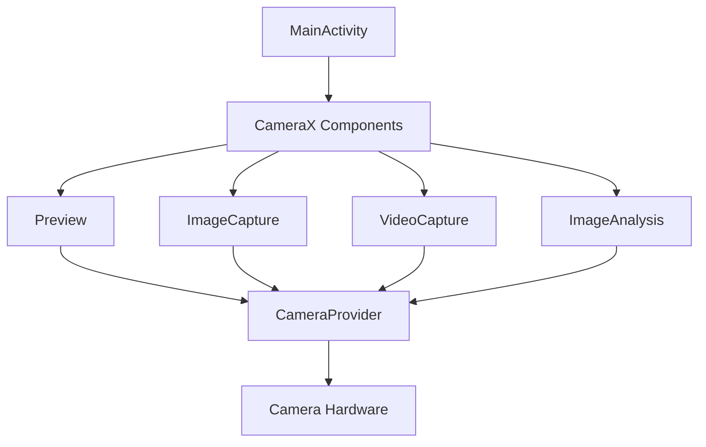
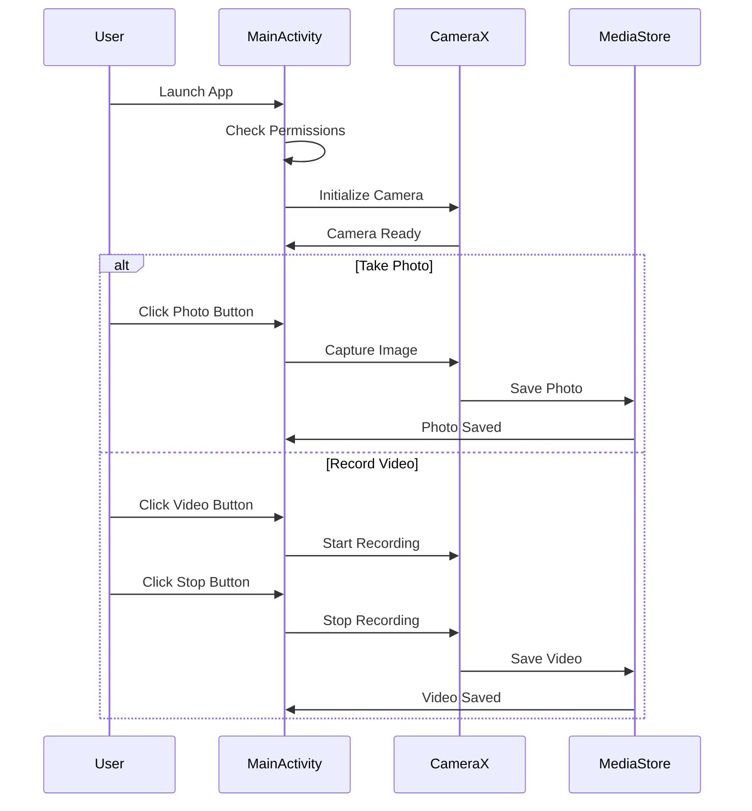
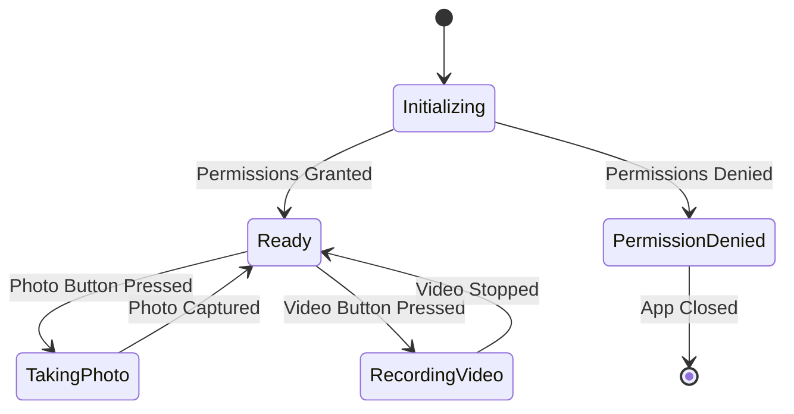

# CameraX App

A modern Android application that demonstrates the power and simplicity of CameraX API for camera operations. This app showcases how to implement a full-featured camera application with photo capture, video recording, and image analysis capabilities.

## 🚀 Features

- 📸 **Photo Capture**: Take high-quality photos and save them to device storage
- 🎥 **Video Recording**: Record videos with audio support
- 🔍 **Image Analysis**: Real-time image analysis with luminosity calculation
- 📱 **Modern UI**: Clean and intuitive user interface with Material Design 3
- 🔒 **Permission Handling**: Robust permission management for camera and storage access
- 📦 **MediaStore Integration**: Seamless integration with Android's MediaStore for media management

## 🏗️ Architecture

The app follows a clean architecture pattern with the following components:



### Component Flow



## 🛠️ Technical Implementation

### Key Components

1. **CameraX Integration**
   - Uses CameraX 1.2.2 for modern camera operations
   - Implements Preview, ImageCapture, VideoCapture, and ImageAnalysis use cases
   - Handles camera lifecycle management

2. **Permission Management**
   - Runtime permission handling for camera and storage access
   - Graceful fallback for permission denials
   - Support for Android 10+ scoped storage

3. **Media Storage**
   - Integration with MediaStore API
   - Organized storage structure for photos and videos
   - Proper file naming and metadata management

### Dependencies

```gradle
dependencies {
    val cameraXversion = "1.2.2"
    implementation("androidx.camera:camera-core:${cameraXversion}")
    implementation("androidx.camera:camera-camera2:${cameraXversion}")
    implementation("androidx.camera:camera-lifecycle:${cameraXversion}")
    implementation("androidx.camera:camera-video:${cameraXversion}")
    implementation("androidx.camera:camera-view:${cameraXversion}")
    implementation("androidx.camera:camera-extensions:${cameraXversion}")
}
```

## 📱 UI/UX Design

The app features a clean and intuitive interface with:

- Full-screen camera preview
- Large, easily accessible capture buttons
- Clear visual feedback for recording state
- Material Design 3 theming support
- Dark mode compatibility

## 🔄 State Management



## 🎯 Future Improvements

1. **Enhanced Features**
   - Add filters and effects
   - Implement HDR mode
   - Add slow-motion video support
   - Implement portrait mode

2. **UI Enhancements**
   - Add camera controls (flash, timer, etc.)
   - Implement gallery view
   - Add photo/video editing capabilities

3. **Performance Optimizations**
   - Implement image compression
   - Add background processing
   - Optimize memory usage

## 📝 Learning Resources

- [CameraX Documentation](https://developer.android.com/training/camerax)
- [Android MediaStore Guide](https://developer.android.com/training/data-storage/shared/media)
- [Material Design 3](https://m3.material.io/)

## 🤝 Contributing

Contributions are welcome! Please feel free to submit a Pull Request.

## 📄 License

This project is licensed under the MIT License.
